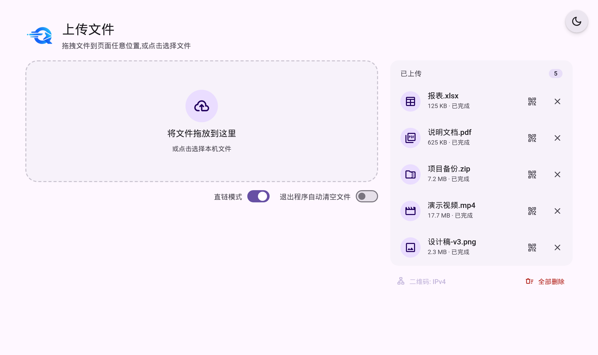

# QuickShare

局域网文件快传。**方便好用的中转方案**



## 为什么做这个

手机、平板、另一台电脑上要拿你电脑里的文件，懒到不想插 U 盘、也不想登录网盘 配置NAS什么的：

- 直接打开这个程序 → 拖文件进来 → 手机上扫二维码 → 直接下载
- 传大文件不过公网、不限速、不压缩
- 不发任何请求到外网，断网也能用（字体和二维码库均采用本地实现）

## 特性

- **拖拽即传**：文件拖进页面立刻开始上传，右栏实时显示进度
- **零复制分享**：点击拖拽区会弹出**本机**的原生文件选择框，选中的文件只记录绝对路径、不复制内容，几百 GB 的文件也是秒分享；源文件被删除/改名后索引会自动失效
- **Shift + 点击**拖拽区则走浏览器上传（手机、远程设备上可用）
- **二维码分享**，IPv4 / IPv6 一键切换；接入 IPv6 后无需刷新页面，会自动出现
- **两种分享链接**
  - 直链模式（默认开）：`http://192.168.1.5:8000/f/季度报告.pdf`，打开即下载
  - 关闭直链：`http://192.168.1.5:8000/d/AbC123`，先打开一个下载页再点下载
- **完全离线**：Material Symbols 图标字体裁切后本地化（约 5 KB），无任何 CDN 依赖
- **断点续传**：下载页和直链都支持 HTTP Range
- **自动清理**：分享默认保留 24 小时；另有「退出程序自动清空文件」开关
- 端口被占用时自动换一个可用端口；Windows 下启动会清理本程序残留的旧进程（不会误杀别的软件）

## 快速开始

需要 Python 3.8+（开发环境为 3.13），只依赖 Flask：

```bash
pip install flask
python server.py
```

> 「免复制分享」用的是标准库 `tkinter` 调本机文件对话框。Windows 官网版 Python 自带；Linux 上可能需要 `sudo apt install python3-tk`。装不上也没关系，该功能会降级为浏览器选择文件。

启动后控制台会打印本机和局域网地址，并自动打开浏览器：

```
  本机访问:     http://localhost:8000
  IPv4 局域网:  http://192.168.1.5:8000
```

按 `Ctrl+C` 关闭。

> Windows 首次运行如果弹出防火墙提示，需要允许「专用网络」访问，否则手机连不上。

## 使用说明

| 操作 | 效果 |
| --- | --- |
| 拖文件到页面任意位置 | 立即上传，右侧「已上传」出现条目 |
| 单击拖拽区 | 弹出本机文件选择框，免复制分享（不复制文件本体） |
| `Shift` + 单击拖拽区 / `Enter` | 走浏览器上传 |
| 点条目上的二维码图标 | 弹窗显示二维码和链接；鼠标悬停可快速预览 |
| 「直链模式」开关 | 决定链接是 `/f/真实文件名`（打开即下载）还是 `/d/<短id>`（下载页） |
| 「退出程序自动清空文件」开关 | 开启后，程序退出时清空上传的临时文件和索引 |
| 右上角齿轮 | 设置里可以改服务端口（见下） |
| 右上角月亮/太阳 | 切换深浅色主题（会记住，默认跟随系统） |

**改端口**：点右上角齿轮 → 填端口 → 保存。服务会当场切到新端口并把配置写进 `uploads/config.json`，页面自动跳转到新地址，**不需要重启程序**。端口被占用时会当场报错让你换一个；如果配置文件里的端口在下次启动时被别的程序占了，程序会自动顺延到下一个可用端口并在控制台提示。

手机扫码后即可下载；文件名带中文、空格、括号都能正常处理（链接里的空格和 `# ? % &` 会换成下划线，**下载下来的文件名保持原样**）。同名文件会自动变成 `报告-2.pdf`。

## HTTP 接口

| 方法 | 路径 | 说明 |
| --- | --- | --- |
| GET | `/` | 上传页 |
| GET | `/d/<id>` | 下载页（含文件名和大小） |
| GET | `/d/<id>/raw` | 按 id 直接下载 |
| GET | `/f/<文件名>` | 直链下载（打开即下载） |
| GET | `/icon.png`、`/favicon.ico` | 图标 |
| GET | `/fonts/<文件>` | 本地字体 |
| GET | `/api/host` | 返回局域网基地址（IPv4 / IPv6） |
| GET | `/api/files` | 当前分享列表 |
| POST | `/api/upload` | 上传（multipart，字段名 `file`） |
| POST | `/api/pick_file` | 弹出服务端原生文件框，做零复制分享 |
| POST | `/api/delete/<id>` | 删除单个分享 |
| POST | `/api/delete_all` | 清空全部（零复制条目只解绑，不删源文件） |
| GET / POST | `/api/config` | 读写配置（`clean_on_exit`、`port`）；改 `port` 会当场切端口 |

出错时接口统一返回 JSON：`{"ok": false, "error": "磁盘剩余空间不足（剩余 2.9 GB）"}`。

## 打包（Windows）

本地打包：

```bash
pip install pyinstaller
pyinstaller QuickShare.spec --noconfirm
```

产物是 `dist/QuickShare.exe`（单文件，约 15 MB，图标已内嵌）。

**也可以交给 CI。** 打 tag 就会自动构建并发布 Release：

```bash
git tag v1.0.0
git push origin v1.0.0        # → Release 里出现 QuickShare.exe
```

不想打 tag 也可以在 Actions 页面手动触发 `构建 Windows 版`，产物在 Artifacts 里下载。CI 除了打包，还会**把 exe 真跑起来抽查接口**（`/api/host`、字体、图标等 7 个路由是否都返回 200），所以构建出来的东西至少是能启动的。

## 项目结构

```
QuickShare/
├─ server.py                  Flask 后端（含下载页模板）
├─ web/                       前端资源（浏览器能拿到的都在这里）
│  ├─ index.html              单页前端（Material 3 设计，原生 JS，无框架）
│  ├─ qrcode.min.js           二维码库（本地，不依赖 CDN）
│  └─ fonts/
│     ├─ material-symbols-rounded.woff2   图标字体（裁切后约 5 KB）
│     ├─ roboto-latin.woff2
│     └─ roboto-latin-ext.woff2
├─ assets/                    图标
│  ├─ logo.png                设计原始文件（不参与构建，改图标时才用）
│  ├─ icon.png                512×512，页面 logo
│  ├─ favicon.ico             浏览器标签页
│  └─ icon.ico                exe 图标（spec 的 icon= 引用它）
├─ docs/screenshot.png        界面截图
├─ tools/build_icon_font.py   重新生成图标字体子集
├─ .github/workflows/build-windows.yml   打 tag 自动构建 Windows 版
├─ QuickShare.spec            PyInstaller 打包脚本
├─ requirements.txt           运行时依赖（只有 Flask）
├─ README.md
└─ uploads/                   运行时数据（自动创建，不要提交）
   ├─ metadata.json           文件索引（唯一数据源，原子写入）
   └─ config.json             配置：clean_on_exit、port
```

打包时 `web/` 和 `assets/` 会按原样放进 exe（见 spec 的 `datas`），运行时从 `sys._MEIPASS` 读，目录结构与源码一致。

## 开发备注

**新增图标后要重新裁切图标字体。** 前端用的图标字体是从 Google 官方字体裁出来的子集（5.4 MB → 5 KB），只保留页面里真正用到的图标。往页面里加了新图标名之后：

```bash
pip install fonttools uharfbuzz
python tools/build_icon_font.py
```

脚本会自动扫描页面、下载官方字体、裁切，并用 HarfBuzz 逐字校验裁切后的渲染结果与官方字体一致。

**图标**由 `assets/icon.png`（512×512，透明底）生成，产物也放回 `assets/`：

```python
from PIL import Image
im = Image.open('assets/icon.png').convert('RGBA')
im.save('assets/favicon.ico', sizes=[(16,16), (32,32), (48,48)])
im.save('assets/icon.ico', sizes=[(16,16), (32,32), (48,48), (64,64), (128,128), (256,256)])
```

`assets/logo.png` 是设计原始文件，只用于重新裁切出 `icon.png`（裁掉字标、补成正方形），不参与运行和构建。

**元数据**只有 `uploads/metadata.json` 一份，读写都在锁内、原子替换（先写临时文件再 `os.replace`），写入中途被杀不会损坏。

## 注意

- **没有任何鉴权**。同一局域网内任何人都能上传、列出、删除分享。请只在可信网络（家里、公司内网）使用，用完就关。
- 分享默认 **24 小时后自动清理**，上传的临时文件会被**物理删除**（不是移到回收站）。零复制的条目只删索引，源文件不动。
- 程序监听 `0.0.0.0`，局域网可达；不需要外网。

## License

未指定。
